# D01_Linux-1

## Contents:

1 [Установка ОС](#part-1-установка-ос)  
 2 [Создание пользователя](#part-2-создание-пользователя)  
 3 [Настройка сети ОС](#part-3-настройка-сети-ос)  
 4 [Обновление ОС](#part-4-обновление-ос)  
 5 [Использование команды sudo](#part-5-использование-команды-sudo)  
 6 [Установка и настройка службы времени](#part-6-установка-и-настройка-службы-времени)  
 7 [Установка и использование текстовых редакторов](#part-7-установка-и-использование-текстовых-редакторов)  
 8 [Установка и базовая настройка сервиса SSHD](#part-8-установка-и-базовая-настройка-сервиса-sshd)  
 9 [Установка и использование утилит top, htop](#part-9-установка-и-использование-утилит-top-htop)  
 10 [Использование утилиты fdisk](#part-10-использование-утилиты-fdisk)  
 11 [Использование утилиты df](#part-11-использование-утилиты-df)  
 12 [Использование утилиты du](#part-12-использование-утилиты-du)  
 13 [Установка и использование утилиты ncdu](#part-13-установка-и-использование-утилиты-ncdu)  
 14 [Работа с системными журналами](#part-14-работа-с-системными-журналами)  
 15 [Использование планировщика заданий CRON](#part-15-использование-планировщика-заданий-cron)

## Part 1. Установка ОС

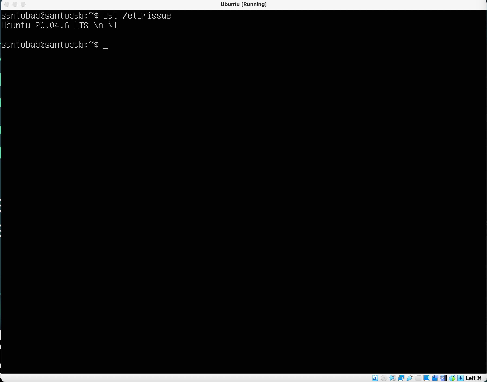

- Версия Ubuntu 20.04.6 LTS

## Part 2. Создание пользователя

- Выполняется через команду `sudo adduser santobab2`

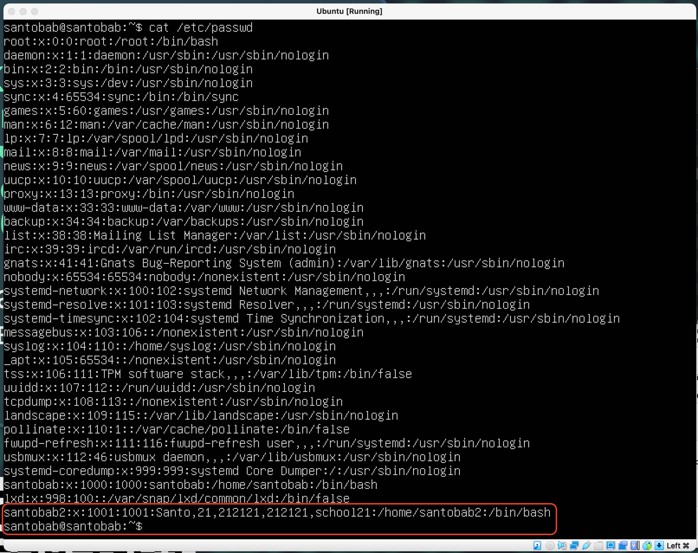

- Создался пользователь с ником `santobab2` со всеми дополнительными данными.

## Part 3. Настройка сети ОС

### Задать название машины вида user-1

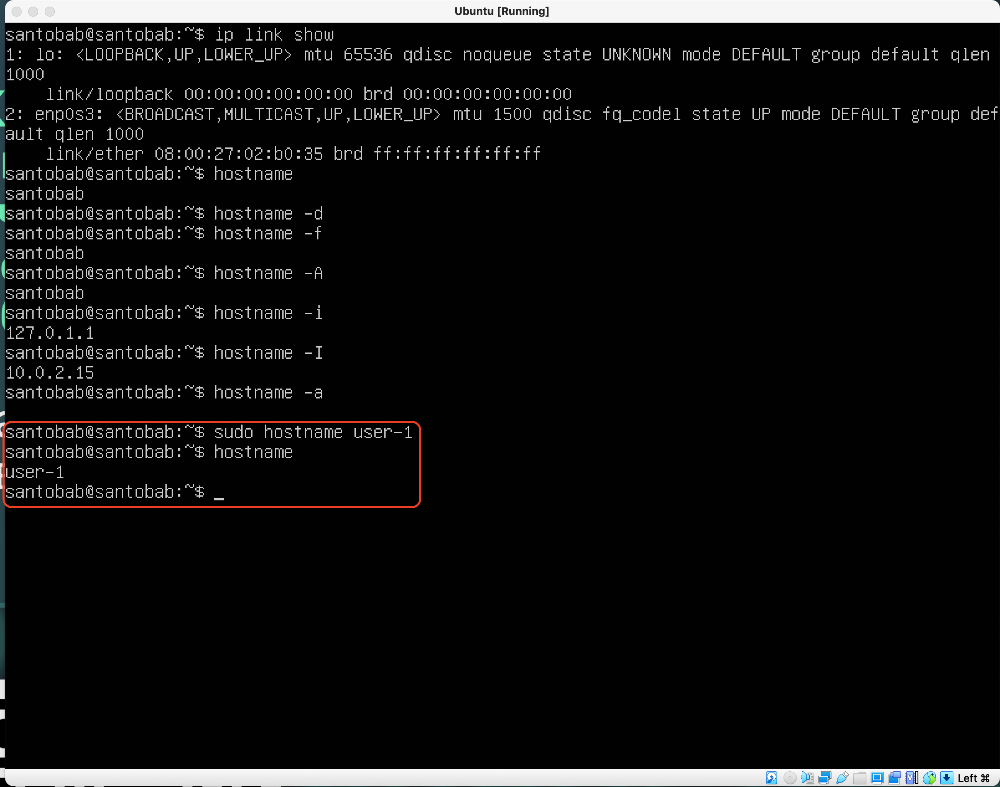

### Установить временную зону, соответствующую вашему текущему местоположению.

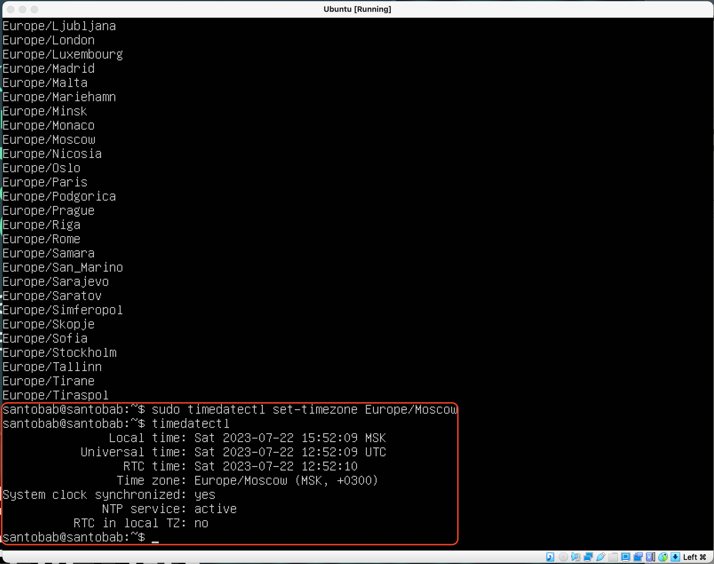

- `sudo timedatectl set-timezone Europe/Moscow`

### Вывести названия сетевых интерфейсов с помощью консольной команды.

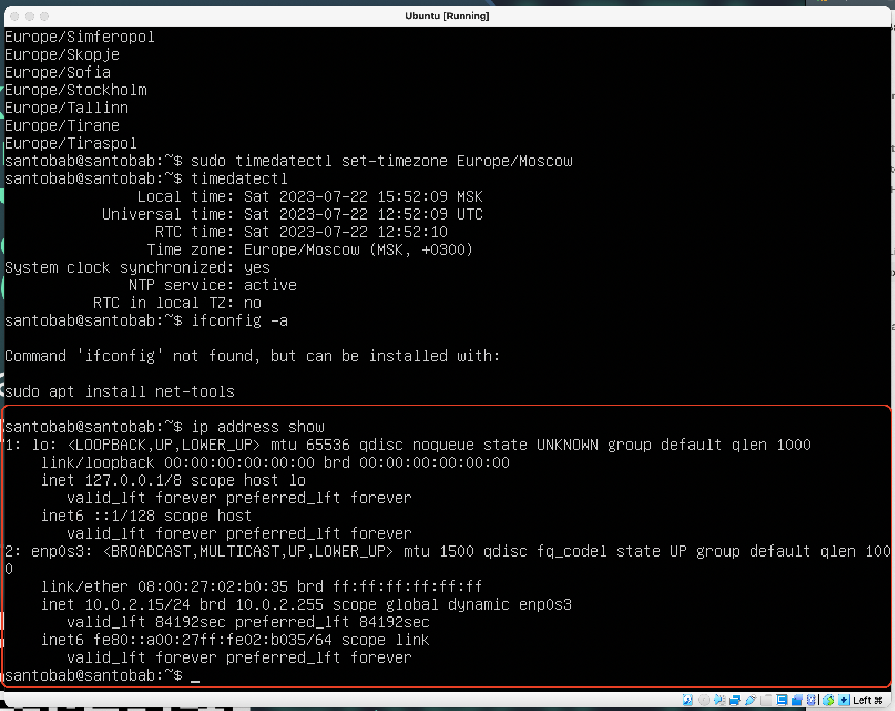

- Интерфейс lo является локальной петлей, которая предназначена для обеспечения сетевого доступа к компьютеру и всегда имеет IP-адрес `127.0.0.1`

### Используя консольную команду получить ip адрес устройства, на котором вы работаете, от DHCP сервера.

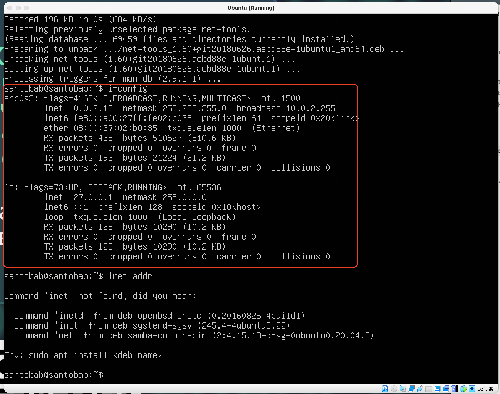

- `ifconfg || sudo ifconfig enp0s3`
- inet - IPv4-адрес, inet6 - IPv6 адрес, netmask - маска подсети и шлюз. А UP - значит включен интерфейс, DOWN - выключен.
  - На всякий случай: Расшифровка аббревиатуры DHCP - Dynamic Host Configuration Protocol

### Определить и вывести на экран внешний ip-адрес шлюза (ip) и внутренний IP-адрес шлюза, он же ip-адрес по умолчанию (gw).

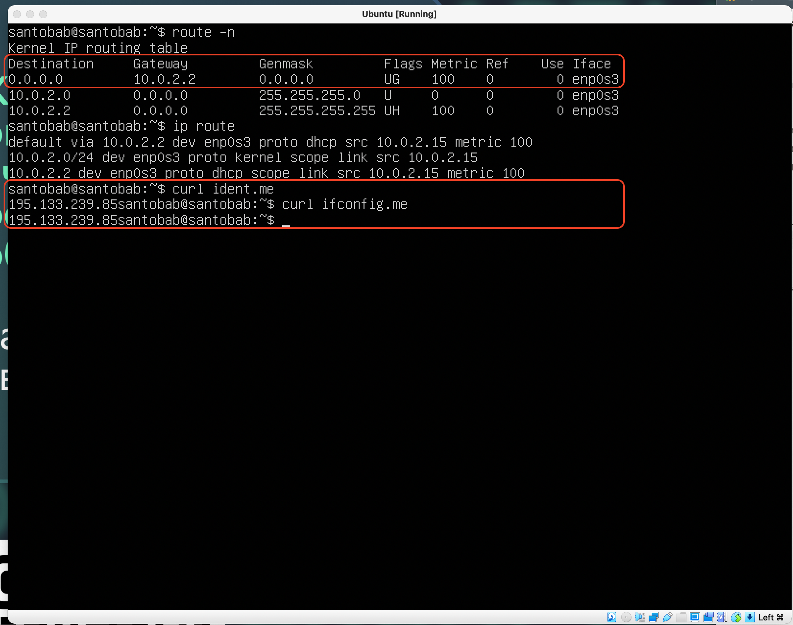

### Задать статичные (заданные вручную, а не полученные от DHCP сервера) настройки ip, gw, dns (использовать публичный DNS серверы, например 1.1.1.1 или 8.8.8.8).

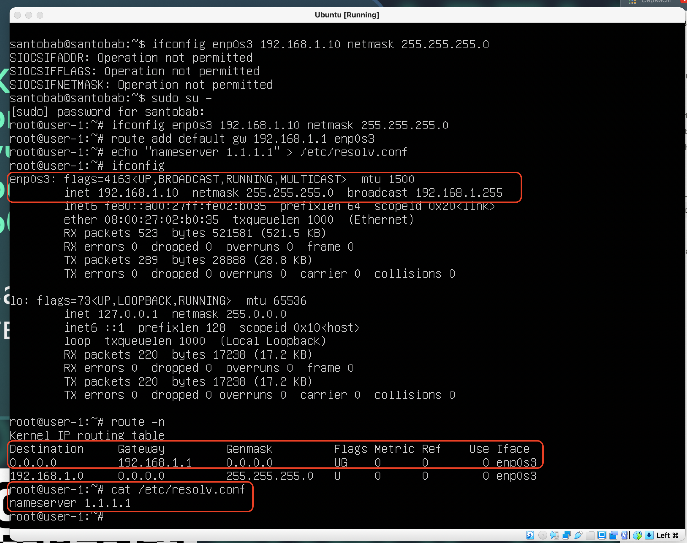

### Перезагрузить виртуальную машину. Убедиться, что статичные сетевые настройки (ip, gw, dns) соответствуют заданным в предыдущем пункте.

- `sudo su -`
  `ifconfig enp0s3 192.168.1.10 netmask 255.255.255.0`
  `route add default gw 192.168.1.1 enp0s3`
  `echo “nameserver 1.1.1.1” > /etc/resolv.conf` или `echo “santobab@server 8.8.8.8” > /etc/resolv.conf`

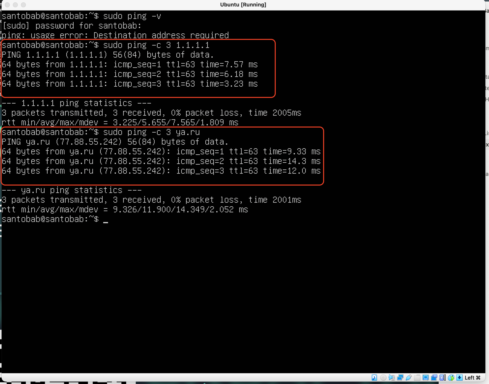

- 3 пакета, 100% packet loss (из root не посылаются пинги)

## Part 4. Обновление ОС

### Обновить системные пакеты до последней на момент выполнения задания версии.

## Part 5. Использование команды **sudo**

### Разрешить пользователю, созданному в [Part 2](screenshots.md), выполнять команду sudo.

- `sudo usermod -a -G sudo santobab2`
  `su santobab2`
  `sudo hostname santobab2`
- Команда **sudo** в Linux предназначена для предоставления временных привилегий администратора (root) обычным пользователям системы. С помощью этой команды обычные пользователи могут выполнять определенные команды с правами администратора без необходимости полного входа в систему под учетной записью с правами суперпользователя.

## Part 6. Установка и настройка службы времени

- `service chrony status`
  `systemctl enable chrony`
  `timedatectl show`

## Part 7. Установка и использование текстовых редактора.

### Используя каждый из трех выбранных редакторов, создайте файл _test_X.txt_, где X -- название редактора, в котором создан файл. Напишите в нём свой никнейм, закройте файл с сохранением изменений.

- Для выхода из vim редактора нужно:
  - `ESC`
  - `:w(write) q(quit)`

- Для выхода из nano редактора:
  - `CTRL + X`
  - `Y`

- Для выхода из joe редактора нужно:
  - `CTRL + K`
  - `X || Q` (с предложением сохранения)

### Используя каждый из трех выбранных редакторов, откройте файл на редактирование, отредактируйте файл, заменив никнейм на строку "21 School 21", закройте файл без сохранения изменений.

- `ESC`
- `:q!`
- `Enter`

- `CTRL + X`
- `N`

- `CTRL + K`
- `Q`
- `No`

### Используя каждый из трех выбранных редакторов, отредактируйте файл ещё раз (по аналогии с предыдущим пунктом), а затем освойте функции поиска по содержимому файла (слово) и замены слова на любое другое.

- Для поиска
  - `/santobab`
- Для поиска и замены
  - `:s/santobab/nesantobab`

- Для поиска
  - `CTRL + W`
- Для поиска и замены
  - `CTRL + \`
  - Искомое слово
  - Заменяемое слово
  - `Enter`

- Для поиска
  - `CTRL + K`
  - `F`
- Для поиска и замены
  - `CTRL + K`
  - `F(ind)`
  - `R(eplace)`
  - `Y(es)`

## Part 8. Установка и базовая настройка сервиса **SSHD**

### Установить службу SSHd.

### Добавить автостарт службы при загрузке системы.

### Перенастроить службу SSHd на порт 2022.

### Используя команду ps, показать наличие процесса sshd. Для этого к команде нужно подобрать ключи.

**Значение команды и ключей:**

- **`ps`**: Команда для отображения текущих активных процессов (process status).
- **`ef`**: Ключи, которые указывают **`ps`** вывести информацию о всех процессах в системе (всех процессах пользователей) в полном формате (full format).
  - **`e`**: Выводить информацию обо всех процессах, не ограничиваясь только процессами текущего пользователя.
  - **`f`**: Выводить полную информацию о процессе, включая родительский процесс (PPID), UID, GID, использование CPU, использование памяти и др.
- `|` : оператор который передает вывод команды `ps -ef` на поиск `grep` который ищет по ключевому слову “sshd”

### Перезагрузить систему.

- Для установки службы SSHD:
  - sudo apt install openssh-server
- Для автостарта службы SSHD:
  - `sudo systemctl enable ssh`
  - `sudo systemctl restart ssh`
- Для перенастройки службы SSHD на порт 2022:
  - `sudo nano /etc/ssh/sshd_config`
  - `#Port 22 → Port 2022`
  - `sudo systemctl restart ssh`
- Для поиска процесса службы SSHD можно воспользоваться перенаправлением вывода команды `ps -ef` в текстовый файл или в командной строке прописать `ps -ef | grep sshd` . Для того чтобы найти процесс в текстовом файле воспользуемся командами из [Part 7.](screenshots.md)
- Для перезагрузки системы - `reboot`

В команде **`netstat -tan`**, ключи **`-tan`** имеют следующие значения:

- **`t`**: Отображает только TCP-соединения (Transmission Control Protocol). Это позволяет нам увидеть только активные TCP-соединения и прослушиваемые TCP-порты.
- **`a`**: Отображает все соединения, включая прослушиваемые порты и активные соединения. Это позволяет нам увидеть как активные, так и прослушиваемые порты, которые прослушивают процессы на компьютере.
- **`n`**: Отображает числовые значения портов и IP-адресов, а не пытается разрешить их в имена хостов и службы (без разрешения DNS). Это ускоряет вывод и позволяет нам увидеть только числовые значения.

Значение каждого столбца вывода команды **`netstat -tan`**:

1. **Протокол (Proto)**: Указывает тип протокола для соединения (например, TCP или UDP).
2. **Локальный адрес (Local Address)**: Это адрес и порт на локальном компьютере. Локальный адрес определяет, с каким интерфейсом и портом связано данное соединение или прослушиваемый порт.
3. **Внешний адрес (Foreign Address)**: Это адрес и порт удаленного компьютера, с которым установлено активное TCP-соединение. Для прослушиваемых портов значение внешнего адреса будет **`0.0.0.0`**, что указывает на прослушивание всех интерфейсов.
4. **Состояние (State)**: Этот столбец указывает текущее состояние активного TCP-соединения. Например, **`LISTEN`** означает установленное и работающее соединение между локальным и удаленным адресами.

Значение **`0.0.0.0`** в столбце "Внешний адрес" (Foreign Address) указывает на прослушивание всех интерфейсов (или всех доступных IP-адресов) на прослушиваемом порту. Когда процесс на компьютере начинает слушать порт, он может слушать либо определенный IP-адрес, либо все доступные IP-адреса. Значение **`0.0.0.0`** указывает, что порт слушается на всех доступных IP-адресах, доступных на данном компьютере. Это позволяет процессу принимать входящие соединения от любого IP-адреса, на котором он работает.

## Part 9. Установка и использование утилит **top**, **htop**

### Установить и запустить утилиты top и htop.

- По выводу команды top:
  - uptime - 25 минут
  - количество авторизованных пользователей - 1 авторизованный пользователь
  - общую загрузку системы:
    - за последнюю минуту - 0.00
    - за последние 5 минут - 0.00
    - за последние 15 минут - 0.00
  - общее количество процессов - 96 процессов
  - загрузку cpu - 0.0%
  - загрузку памяти - 159.1КiB
  - pid процесса занимающего больше всего памяти - 2146 : 0,2%
  - pid процесса, занимающего больше всего процессорного времени - 2146 : 3,6%

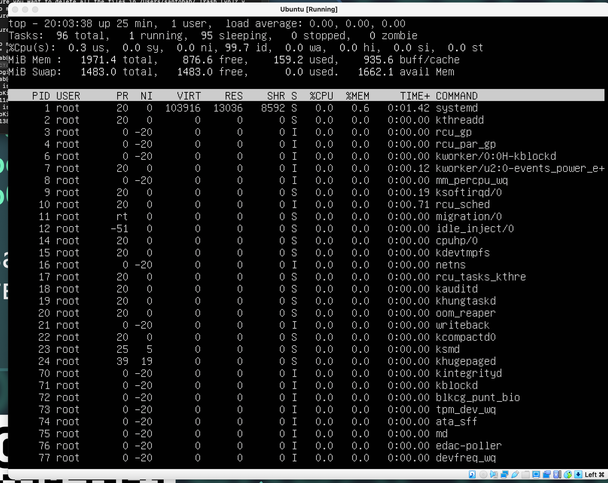

- В отчёт вставить скрин с выводом команды htop:
- отсортированному по PID, PERCENT_CPU, PERCENT_MEM, TIME

- отфильтрованному для процесса sshd

- с процессом syslog, найденным, используя поиск

- `htop -p "$(pgrep syslog | tr '\n' ',')”`
- с добавленным выводом hostname, clock и uptime

## Part 10. Использование утилиты **fdisk**

### Запустить команду fdisk -l.

Основной жесткий диск:

- Название `/dev/sda`
- Размер - 10 GiB или 10737428340
- Количество секторов - 20 971 520

Раздел области подкачки (swap) имеет следующие характеристики:

- Название раздела: **`/dev/sda2`**
- Размер раздела - 1.8 GiB (или 3 760 016)

## Part 11. Использование утилиты **df**

### Запустить команду df.

- Root partition occupies(/):
  - Partition size - 1К х 8408452 KiB
  - The size of the occupied space - 4056340 KiB
  - The size of free space - 3903396 KiB
  - The percentage usage - 51%

### Запустить команду df -Th.

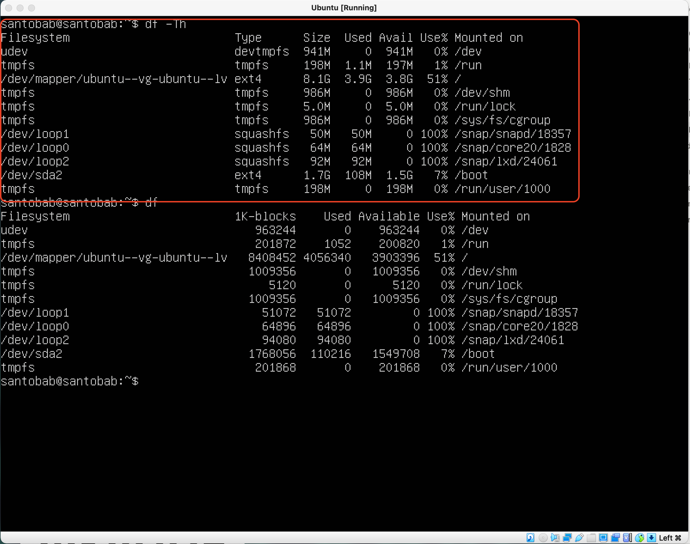

- Root partition occupies(/):
  - Partition size - 8.1GiB
  - The size of the occupied space - 3.9GiB
  - The size of free space - 3.8GiB
  - The percentage usage - 51%
- The `df -hx tmpfs` script shows us information in a readable and convenient form in gigabytes and megabytes

- Type of the filesystem is `ext4`

## Part 12. Использование утилиты **du**

### Запустить команду du.

### Вывести размер папок /home, /var, /var/log (в байтах, в человекочитаемом виде)

### Вывести размер всего содержимого в /var/log (не общее, а каждого вложенного элемента, используя \*)

- `du -sbh /var/log/*`

## Part 13. Установка и использование утилиты **ncdu**

### Установить утилиту ncdu.

### Вывести размер папок /home, /var, /var/log.

## Part 14. Работа с системными журналами

### Открыть для просмотра:

### 1. /var/log/dmesg

### 2. /var/log/syslog

### 3. /var/log/auth.log

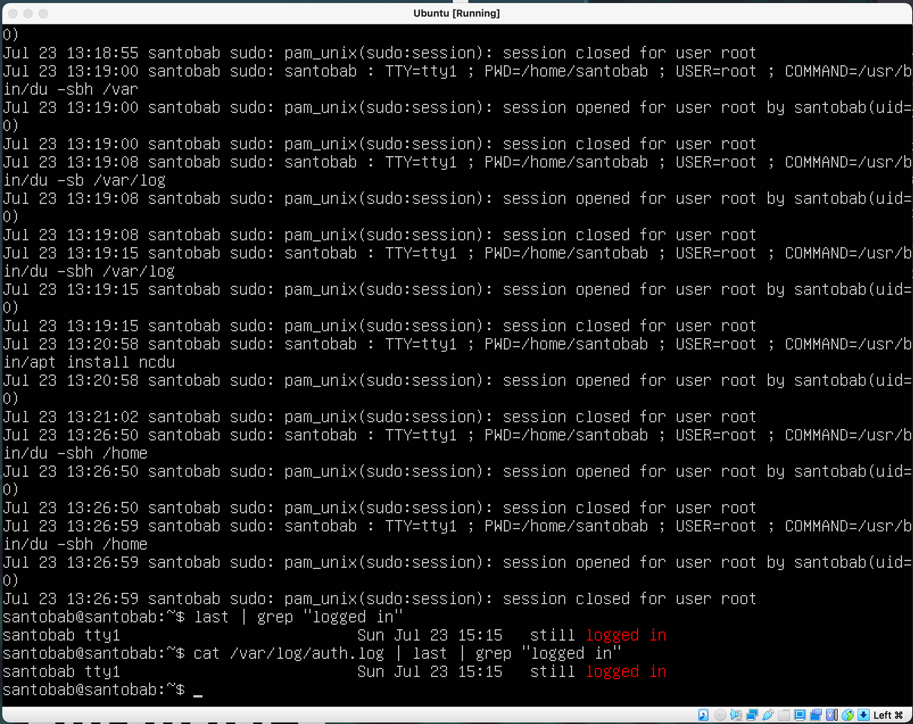

- 15:15 - authorization time
- `santobab`
- `santobab` вошел в систему локально на консоли (**`tty1`**).

## Part 15. Использование планировщика заданий **CRON**

### Используя планировщик заданий, запустите команду uptime через каждые 2 минуты.

- crontab -e
- _/2 _ \* \* \* uptime
- crontab -l

### Удалите все задания из планировщика заданий.

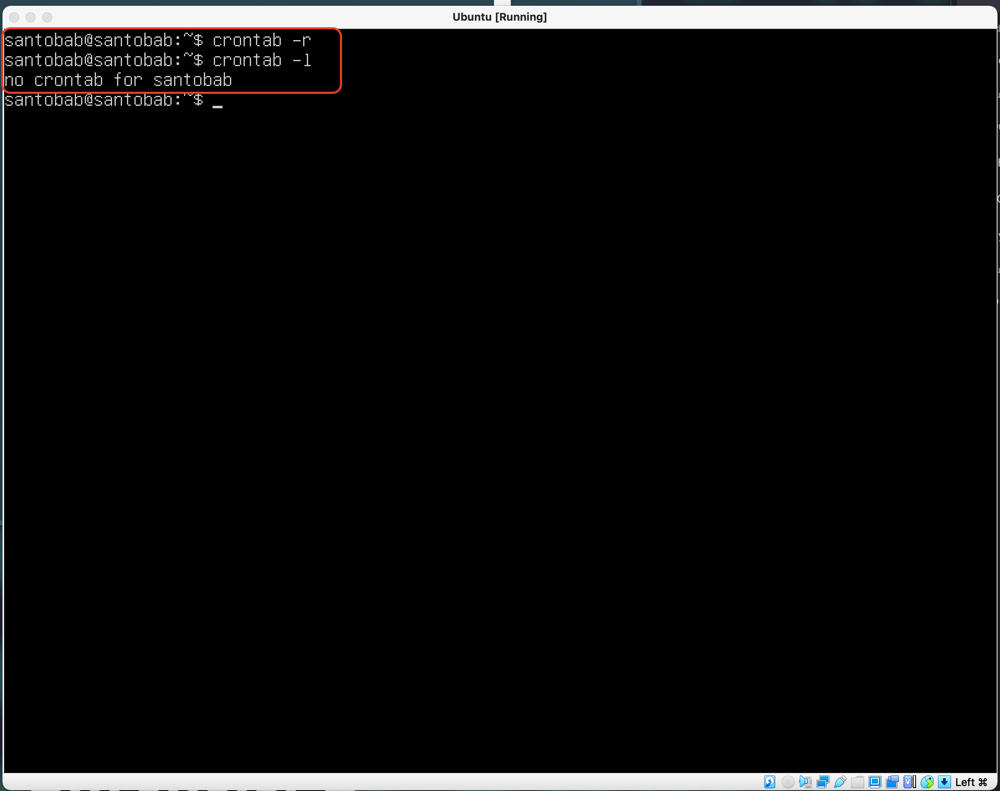

- All commands on run were deleted by using command `crontab -r`
